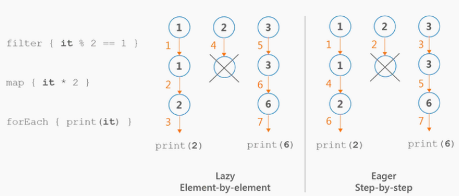
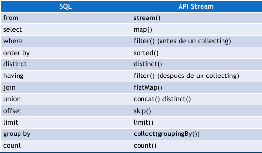

# Programación - 06 Programación Funcional. Programación con Genéricos. Uso de TDAs y Colecciones

Tema 06 Programación Funcional. Programación con Genéricos. Uso de TDAs y Colecciones. 1DAW. Curso 2023/2024.


- [Programación - 06 Programación Funcional. Programación con Genéricos. Uso de TDAs y Colecciones](#programación---06-programación-funcional-programación-con-genéricos-uso-de-tdas-y-colecciones)
  - [Contenidos](#contenidos)
  - [Programación Funcional](#programación-funcional)
    - [Closure](#closure)
    - [Funciones anónimas](#funciones-anónimas)
    - [Funciones lambda](#funciones-lambda)
    - [Funciones de orden superior](#funciones-de-orden-superior)
  - [Funciones de extensión](#funciones-de-extensión)
  - [Sobrecarga de operadores](#sobrecarga-de-operadores)
  - [Funciones inline](#funciones-inline)
  - [Funciones refied](#funciones-refied)
  - [Funciones infix o infijas](#funciones-infix-o-infijas)
  - [Funciones con receiver](#funciones-con-receiver)
  - [Scope functions](#scope-functions)
    - [let](#let)
    - [run](#run)
    - [with](#with)
    - [apply](#apply)
    - [also](#also)
  - [Tipos Genéricos](#tipos-genéricos)
    - [Tipos y subtipos](#tipos-y-subtipos)
    - [Varianza](#varianza)
    - [Invarianza](#invarianza)
    - [Covarianza](#covarianza)
    - [Contravarianza](#contravarianza)
    - [Proyectividad](#proyectividad)
    - [Acotaciones](#acotaciones)
  - [Tipos de Datos Abstractos](#tipos-de-datos-abstractos)
    - [Pair y Triple](#pair-y-triple)
  - [Colecciones](#colecciones)
  - [Listas, Pilas y Colas](#listas-pilas-y-colas)
    - [Listas](#listas)
    - [Pilas](#pilas)
    - [Colas](#colas)
  - [Comparadores](#comparadores)
    - [Comparable](#comparable)
    - [Comparator](#comparator)
  - [Conjuntos](#conjuntos)
  - [Mapas](#mapas)
  - [Operaciones con colecciones](#operaciones-con-colecciones)
    - [Operaciones de filtrado](#operaciones-de-filtrado)
    - [Operaciones con operadores](#operaciones-con-operadores)
    - [Operaciones de transformación](#operaciones-de-transformación)
    - [Operaciones de búsqueda](#operaciones-de-búsqueda)
    - [Obtener subcolecciones](#obtener-subcolecciones)
    - [Operaciones de ordenación](#operaciones-de-ordenación)
    - [Operaciones de agrupación](#operaciones-de-agrupación)
    - [Operaciones de agregación](#operaciones-de-agregación)
  - [Secuencias](#secuencias)
    - [Creación de secuencias](#creación-de-secuencias)
    - [Operaciones](#operaciones)
    - [Operaciones con secuencias](#operaciones-con-secuencias)
    - [Iterables vs Secuencias](#iterables-vs-secuencias)
  - [Operaciones con Colecciones y SQL](#operaciones-con-colecciones-y-sql)
  - [Optional](#optional)
  - [Formateadores y Localización](#formateadores-y-localización)
  - [Otros ejemplos](#otros-ejemplos)
  - [Autor](#autor)
    - [Contacto](#contacto)
  - [Licencia de uso](#licencia-de-uso)

## Contenidos
1. Programación Funcional
   1. Funciones de extensión
   2. Sobrecarga de operadores
   3. Funciones inline
   4. Funciones refied
   5. Funciones infix o infijas
   6. Funciones con receiver
   7. Scope functions
2. Tipos Genéricos
3. Tipos de Datos Abstractos
4.  Introducción a las Colecciones
    1.  Listas, Pilas y Colas
    2.  Comparadores
    3.  Conjuntos
    4.  Mapas
    5.  Operaciones con Colecciones: Filtrado, Mapeado, Agrupado, Ordenado, etc.
    6.  Secuencias
5.  Optional
6.  Formateadores y Localización

## Programación Funcional
La programación funcional es un paradigma de programación que trata de la evaluación de funciones matemáticas y evitar el uso de estados y datos mutables. En este paradigma, las funciones son tratadas como valores de primera clase, lo que significa que las funciones pueden ser pasadas como argumentos a otras funciones, pueden ser devueltas por otras funciones y pueden ser asignadas a variables o elementos de datos.

```kotlin
// Función como definición
fun suma(a: Int, b: Int): Int {
    return a + b
}
// Función como expresión
fun suma(a: Int, b: Int): Int = a + b
// Función anónima
val suma = fun(a: Int, b: Int): Int = a + b
// Función lambda
val suma = { a: Int, b: Int -> a + b }
```
### Closure
La función closure es una función que recuerda el entorno en el que se ha creado y con ello podemos definir una función dentro de otra función, y que esta nueva función pueda acceder a las variables de la función que la contiene.

```kotlin
fun suma(a: Int, b: Int): Int {
    
    fun sumar(): Int {
        return a + b
    }

    return sumar()
}

fun main() {
    val resultado = suma(2, 3)
    println(resultado)
}
```

### Funciones anónimas
Las funciones anónimas son funciones que no tienen nombre. En Kotlin, las funciones anónimas se definen con la palabra clave fun seguida de un conjunto de parámetros entre paréntesis, un operador de flecha (->) y un cuerpo de función. Las funciones anónimas se pueden asignar a variables o pasar como argumentos a otras funciones.

```kotlin
// Función anónima
val suma = fun(a: Int, b: Int): Int = a + b

// Uso de la función anónima
fun main() {
    val resultado = suma(2, 3)
    println(resultado)
}
```

### Funciones lambda
Las funciones lambda son funciones anónimas que se pueden pasar como argumentos a otras funciones y definimos su comportamiento cuando lo necesitemos. En Kotlin, las funciones lambda se definen entre llaves y se pueden asignar a variables o pasar como argumentos a otras funciones.

```kotlin
// Función lambda
val suma = { a: Int, b: Int -> a + b }

// Uso de la función lambda
fun main() {
    val resultado = suma(2, 3)
    println(resultado)
}
```

### Funciones de orden superior
Las funciones de orden superior son funciones que toman otras funciones como argumentos o devuelven funciones como resultado. En Kotlin, generalmente se usan lambda para pasar funciones como argumentos indicando el comportamiento que queremos que tengan.

Debemos tener en cuenta que si la función pasada por parámetro es la última, podemos colocarla fuera de los paréntesis.

El parámetro de la función lambda se puede omitir si solo se usa una vez en el cuerpo de la función lambda. Usaremos el nombre it para referirnos a ese parámetro si es necesario.

```kotlin
// Función de orden superior, operación es una función que acepta dos enteros y devuelve un entero
fun operar(a: Int, b: Int, op: (Int, Int) -> Int): Int {
    return op(a, b)
}

// myRepeat es una función que acepta un entero y una función que acepta un entero y no devuelve nada
fun myRepeat(times: Int, op: (Int) -> Unit) {
    for (i in 0 until times) {
        op(i)
    }
}

fun myForEach(list: List<Int>, op: (Int) -> Unit) {
    for (i in list) {
        op(i)
    }
}

// Uso de la función de orden superior, como el parametro que pasamos como lambda es la última podemos colocarlo fuera de los paréntesis
fun main() {
    val resultado = operar(2, 3) { a, b -> a + b }
    println(resultado)

    myRepeat(5) { println("Hola $it") }

    myForEach(listOf(1, 2, 3, 4, 5)) { println(it) }
}
```

## Funciones de extensión
Las funciones de extensión son funciones que se pueden añadir a una clase/tipo sin heredar de ella. En Kotlin, las funciones de extensión se definen con la palabra clave fun seguida del nombre de la clase a la que se añaden, un punto y el nombre de la función.

```kotlin
// Función de extensión
fun String.repetir(times: Int): String {
    var result = ""
    for (i in 0 until times) {
        result += this
    }
    return result
}

fun Int.sumar(a: Int): Int {
    return this + a
}

// Uso de la función de extensión
fun main() {
    val resultado = "Hola ".repetir(3)
    println(resultado)

    val resultado2 = 2.sumar(3)
    println(resultado2)
}
```
## Sobrecarga de operadores
La sobrecarga de operadores es la posibilidad de definir el comportamiento de los operadores para nuestros propios tipos. En Kotlin, la sobrecarga de operadores se define con la palabra clave operator seguida del nombre del operador y el cuerpo de la función y [redefiniendo la función asociada](https://kotlinlang.org/docs/operator-overloading.html).

```kotlin
// Sobrecarga de operadores
operator fun String.times(times: Int): String {
    var result = ""
    for (i in 0 until times) {
        result += this
    }
    return result
}

operator fun Int.plus(a: Int): Int {
    return this + a
}

// Uso de la sobrecarga de operadores
fun main() {
    val resultado = "Hola " * 3
    println(resultado)

    val resultado2 = 2 + 3
    println(resultado2)
}
```

## Funciones inline
Las funciones de orden superior tienen ciertas penalizaciones de tiempo de ejecución:
cada función es un objeto y captura un cierre.
Un cierre es un ámbito de variables a las que se puede acceder en el cuerpo de la función.
Las asignaciones de memoria (tanto para objetos de función como para clases) y
las llamadas virtuales introducen una sobrecarga de tiempo de ejecución.
- Con [inline](https://kotlinlang.org/docs/inline-functions.html), pegamos el cuerpo de la lambda en el lugar donde se llama a la función. Crece el código, pero ahorramos memoria y tiempo de ejecución. Hay que buscar el equilibrio entre el tamaño del código y el tiempo de ejecución. No siempre interesa.
- noinline: para que no se haga inline una función lambda o función de orden superior eligiendo la que queremos que no se haga inline o no.
- crossinline: para que no se haga inline una función lambda aunque se llame desde una inline. Con ello evitamos que se puedan hacer retunes, pues recuerda que el inline pega el código. [Revisa este enlace para más información](https://www.baeldung.com/kotlin/crossinline-vs-noinline).

```kotlin
// Función inline
inline fun myRepeat(times: Int, op: (Int) -> Unit) {
    for (i in 0 until times) {
        op(i)
    }
}

// Uso de la función inline, pegamos el cuerpo de la lambda en el lugar donde se llama a la función a nivel de código intermedio (bytecode)
fun main() {
    myRepeat(5) { println("Hola $it") }
}
```

## Funciones refied
Las funciones refied son funciones que permiten acceder a la información de tipo en tiempo de ejecución. En Kotlin, las funciones refied se definen con la palabra clave reified seguida del nombre de la función y el cuerpo de la función.

Kotlin y Java borran la información de tipo genérico en el momento de la compilación o sea todos los posibles formas de genéricos se manfiestan como raw raw en tiempo de ejecución. Es decir List<Int> y  List<String> son solo List en tiempo de ejecución. Con refied podemos acceder a la información de tipo genérico en tiempo de ejecución

```kotlin
// Función refied
inline fun <reified T> isA(value: Any) = value is T

// Uso de la función refied
fun main() {
    println(isA<String>("Hola"))
    println(isA<String>(123))
}
```

## Funciones infix o infijas
Las funciones infix son funciones que permiten llamar a una función como si fuera un operador. En Kotlin, las funciones infix se definen con la palabra clave infix seguida del nombre de la función y el cuerpo de la función.

```kotlin
// Función infix
infix fun String.repetir(times: Int): String {
    var result = ""
    for (i in 0 until times) {
        result += this
    }
    return result
}

infix fun Int.pow(n: Int): Int {
    return this.toDouble().pow(n).toInt()
}

// Uso de la función infix
fun main() {
    val resultado = "Hola " repetir 3
    println(resultado)

    val resultado2 = 2 pow 3
}
```

## Funciones con receiver
Lambda con Receiver es una mezcla de Lambda Funciones de extensión. Las[ lambdas con receptores](https://kotlinlang.org/docs/lambdas.html#function-literals-with-receiver) son básicamente iguales a las funciones de extensión, solo se pueden almacenar en propiedades y pasar a las funciones. Dentro del cuerpo de la función literal, el objeto receptor pasado a la llamada se convierte en un implícito this y con ello ejecutar cualquier propiedad o método disponible.
De esta [manera](https://www.baeldung.com/kotlin/lambda-receiver) conseguimos que en el cuerpo de la lambda podamos acceder a las propiedades y métodos del objeto receptor.
Nos sirve para extender funciones de una clase y aplicar una función a cada una de las funciones de la clase
con ello podemos hacer safebuilders o DSL

```kotlin
// Aquí esta claro que extendemos  con una función de extensión y con una función de receptor
fun Int.sumExtension(other: Int): Int = this + other
// 3.sumExtension(4) --> 7 pero yo no puedo hacer sumExtension(3,4), pierdo esa opción

// Pero vamos a hacerlo de esta manera. De esta manera usamos el lambda con el receptor
// tenemos implicito el this
val sum: Int.(Int) -> Int = { a -> this + a } // this es el Int que recibe la función


// Aqui extendemos con opp que a su vez como parámetro usa en vez de una función o lambda una función de extensión
fun Int.opp(f: Int.() -> Int): Int = f()

// safebuilders o DSL
// accedemos a la función append de la clase StringBuilder al ser el receptor
fun buildString(actions: StringBuilder.() -> Unit): String {
    val builder = StringBuilder()
    // Aquí usamos la función de extensión append de la clase StringBuilder y ejecutamos
    // el bloque de código que nos pasan como parámetro
    builder.actions()
    return builder.toString()
}


fun main() {
    // Uso de la función de extensión
    println(3.sumExtension(4)) // 7

    // Uso de la función de receptor
    println(sum(3, 4)) // 7
    println(3.sum(4)) // 7

    // Uso de la función de extensión con la función de receptor
    println(3.opp { this + 4 })

    // safebuilders o DSL
    val result = buildString {
        append("Hola")
        append(" ")
        append("Mundo")
    }.toUpperCase()
    println(result) // HOLA MUNDO
}
```

## Scope functions
Las [funciones de alcance](https://kotlinlang.org/docs/scope-functions.html) son funciones que se pueden llamar en un objeto y que proporcionan un contexto adicional. Las usaremos dependiendo de la situación. Las funciones de alcance son: let, run, with, apply y also. Cada una de ellas tiene sus propias características y se usa en diferentes situaciones dependiendo de si usa o no el contexto del objeto receptor y si devuelve el objeto receptor o no.


### let
La función let se usa para ejecutar un bloque de código en el contexto de *un objeto que se le pasa como parámetro*. La función let *devuelve el resultado del bloque de código*. La función let es útil cuando queremos ejecutar un bloque de código en el contexto de un objeto y queremos devolver un valor. La usaremos para evitar el uso de nullables y seria el equivalente a un if not null.

```kotlin
// Ejemplo de uso de let
fun main() {
    val nombre: String? = "José Luis"
    val apellido: String? = "González Sánchez"

    // Uso de let
    nombre?.let { println(it) }
    apellido?.let { println(it) }

    // es equivalente a
    if (nombre != null) {
        println(nombre)
    }
    if (apellido != null) {
        println(apellido)
    }

    // Uso de let con el operador Elvis
    val nombreCompleto = nombre?.let { n -> apellido?.let { a -> "$n $a" } }
    println(nombreCompleto)
    
    // es equivalente a
    if (nombre != null && apellido != null) {
        val nombreCompleto = "$nombre $apellido"
        println(nombreCompleto)
    }
}
```

### run
La función run se usa para ejecutar un bloque de código en el contexto de un *objeto que se le pasa como receiver*. La función run *devuelve el resultado del bloque de código*. La función run es útil cuando queremos ejecutar un bloque de código en el contexto de un objeto y queremos devolver un valor. Se suele usar para inicializar objetos. 
También podemos usarlo como rama de else junto a let.

```kotlin
// Ejemplo de uso de run
class Persona(var nombre: String, var apellido: String) {
    fun nombreCompleto(): String = "$nombre $apellido"
}

fun main() {
    val persona = Persona("José Luis", "González Sánchez")

    // Uso de run
    val nombreCompleto = persona.run { nombreCompleto() }
    println(nombreCompleto)

    // es equivalente a
    val nombreCompleto2 = persona.nombreCompleto()
    println(nombreCompleto2)

    // Uso de let run como if else
    val nombre: String? = "José Luis"
    val apellido: String? = "González Sánchez"

    // Uso de let
    nombre?.let { println(it) } ?: run { println("No hay nombre") }
    apellido?.let { println(it) } ?: run { println("No hay apellido") }

    // es equivalente a
    if (nombre != null) {
        println(nombre)
    } else {
        println("No hay nombre")
    }
    if (apellido != null) {
        println(apellido)
    } else {
        println("No hay apellido")
    }
}
```

### with
La función with se usa para ejecutar un bloque de código en el contexto de un *objeto que se le pasa como parámetro*. La función with *devuelve el resultado del bloque de código*. La función with es útil cuando queremos ejecutar un bloque de código en el contexto de un objeto y queremos devolver un valor. Es ideal cuando queremos acceder a las propiedades de un objeto sin tener que usar el operador punto.

```kotlin
// Ejemplo de uso de with
class Persona(var nombre: String, var apellido: String) {
    fun nombreCompleto(): String = "$nombre $apellido"
}

fun main() {
    val persona = Persona("José Luis", "González Sánchez")

    // Uso de with, objeto como parámetro
    with(persona) { 
        it.nombre = "José Luis"
        it.apellido = "González Sánchez"
    }
    println(nombreCompleto)
}

```

### apply
La función apply se usa para ejecutar un bloque de código en el contexto de *un objeto que se le pasa como receiver*. La función apply *devuelve el objeto sobre el que se ejecuta*. La función apply es útil cuando queremos ejecutar un bloque de código en el contexto de un objeto y queremos devolver el objeto. Es ideal cuando queremos inicializar y configurar un objeto.

```kotlin
// Ejemplo de uso de apply
class Persona(var nombre: String, var apellido: String) {
    fun nombreCompleto(): String = "$nombre $apellido"
}

fun main() {
    val persona = Persona("José Luis", "González Sánchez")

    // Uso de apply, objeto como receiver this
    persona.apply { 
        nombre = "José Luis"
        apellido = "González Sánchez"
    }
    println(nombreCompleto)
}

```

### also
La función also se usa para ejecutar un bloque de código en el contexto de *un objeto que se le pasa como parámetro*. La función also *devuelve el objeto sobre el que se ejecuta*. La función also es útil cuando queremos ejecutar un bloque de código en el contexto de un objeto y queremos devolver el objeto. Es ideal para indicar efectos adicionales en nuestras acciones.

```kotlin
// Ejemplo de uso de also
class Persona(var nombre: String, var apellido: String) {
    fun nombreCompleto(): String = "$nombre $apellido"
}

fun main() {
    val persona = Persona("José Luis", "González Sánchez")

    // Uso de also, objeto como parámetro it
    persona.apply { 
        it.nombre = "José Luis"
        it.apellido = "González Sánchez"
    }.also {
        println(it.nombreCompleto())
    }
}

```

## Tipos Genéricos
Los tipos genéricos son una forma de reutilizar código, permitiendo que los tipos de datos sean variables. Esto nos permite crear clases, interfaces y métodos que pueden operar con objetos de diferentes tipos, siempre y cuando estos objetos sean compatibles con los parámetros de tipo.

En Kotlin los tipos genéricos se definen con la palabra clave **`<T>`**. Aunque el identificador del tipo genérico puede ser cualquier letra o palabra.

Por ejemplo, si queremos crear una clase que represente una caja de cualquier tipo, podemos hacerlo de la siguiente manera:

```kotlin
class Caja<T>(t: T) {
    var valor = t

    fun obtener(): T {
        return valor
    }

    fun mostrar() {
        println(valor.toString())
    }
}

fun main() {
    val cajaEntero = Caja(10)
    val cajaCadena = Caja("Hola")
    val cajaBooleano = Caja(true)

    cajaEntero.mostrar()
    cajaCadena.mostrar()
    cajaBooleano.mostrar()
}
```

### Tipos y subtipos
Un subitipo es un tipo que hereda de otro tipo. Por ejemplo, Profesor hereda de Persona, por lo que podemos asignar un objeto de tipo Profesor a una variable de tipo Persona. Esto se conoce como subtipado. Pero al contrario no es posible. Esto además debería casar con el principio de sustitución de Liskov y aplicando otros elementos como herencia y polimorfismo.

```kotlin
open class Persona(val nombre: String)
class Profesor(nombre: String, val materia: String) : Persona(nombre)

fun main() {
    val persona: Persona = Profesor("Pepe", "Matemáticas")
    println(persona.nombre)
}
```

### Varianza
La varianza es una propiedad que tienen los tipos genéricos que nos permite definir si un tipo genérico es invariante, covariante o contravariante. Es decir, si un tipo genérico puede ser sustituido por otro tipo genérico de la misma familia. Lamentablemente no se cumple el principio visto en el ejemplo anterior.

Veamos este ejemplo

  

```kotlin
val integer: Int = 1
val number: Number = integer // Esto es posible porque Int es subtipo de Number
val integer: Int = 1;
val nullableInteger: Int? = integer; // Esto es posible porque Int? es subtipo de Int
```

```kotlin
abstract class Animal(val size: Int)
class Dog(val cuteness: Int): Animal(100)
class Spider(val terrorFactor: Int): Animal(1)

fun main() {
    val dog: Dog = Dog(10)
    val spider: Spider = Spider(9000)
    val animal: Animal = dog // Esto es posible porque Dog es subtipo de Animal
    animal = spider // Esto es posible porque Spider es subtipo de Animal
}
```

Lamentablemente cuando estamos con genéricos esto no siempre es posible. Veamos un ejemplo

```kotlin
integerList = mutableListOf(1, 2, 3) 
numberList: MutableList<Number> = integerList; // esto no es posible porque List<Int> no es subtipo de List<Number>
```

Debemos tener en cuenta que los tipos genéricos son invariantes por defecto. Esto es debido a que se puede producir y consumir tipos y que estas colecciones sun mutables. 
Esto quiere decir que no podemos asignar un tipo genérico a otro tipo genérico de la misma familia superior. Para poder hacerlo debemos indicar que el tipo genérico es covariante o contravariante. Para ello debemos indicar la palabra clave **`out`** o **`in`** respectivamente.

***IMPORTANTE***: 
- Colecciones Mutables es invariante con respecto a su tipo genérico. (no podemos ni consumir ni producir/añadir valores con un tipo más genérico)
- Colecciones Inmutables es covariante con respecto a su tipo genérico (podemos consumir sus valores con un tipo más genérico)

¿Qué significa consumir (covarianza) y qué producir (contravarianza)?
- Consumir implica tener funciones que devuelven un valor del tipo genérico
- Producir implica tener funciones que reciben por argumento un objeto del tipo genérico

### Invarianza
La invarianza nos indica que un tipo no puede ser usado en un contexto donde se espera otro tipo. Es la usada por defecto en colecciones mutables tal y como hemos visto.


```kotlin
val integerList: MutableList<Int> = mutableListOf(1, 2, 3)
val numberList: MutableList<Number> = integerList // Esto no es posible porque MutableList<Int> no es subtipo de MutableList<Number>

al dogList: MutableList<Dog> = mutableListOf(Dog(10), Dog(20), Dog(30))
val animalList: MutableList<Animal> = dogList // Esto no es posible porque MutableList<Dog> no es subtipo de MutableList<Animal>
```
    
```kotlin
// Invariante: No sabemos si vamos a consumir o producir, por lo que no podemos usarlo en un contexto donde se espera otro tipo
class EncrypterInvariante<T>(val item: T) {
    fun encrypt(): T {
        return item
    }

    fun decrypt(item: T) {
        println(item.toString())
    }
}

val e: EncrypterInvariante<Int> = EncrypterInvariante(10)
val e2: EncrypterInvariante<Number> = e // Por defecto es invariante, no es posible

```

### Covarianza
La covarianza es la es la capacidad de un tipo de ser usado en un contexto donde se espera un tipo más general. Aparece directamente si las colecciones son inmutables. Además, si queremos detallarlo en otras debemos indicar la palabra clave **`out`**. Por ejemplo, si queremos que una lista de perros pueda ser usada como una lista de animales. Para ello el tipo genérico solo debe aparecer como elemento de salida de una función o como tipo de retorno de una función.


```kotlin
val dogList: List<Dog> = listOf(Dog(10), Dog(20))
val animalList: List<Animal> = dogList // Esto es posible porque List<Dog> es subtipo de List<Animal> Inmutable
```

Otro ejemplo usando out para especificarlo con colecciones mutables o si sabemos con seguridad que no vamos a producir valores, solo consumirlos.

```kotlin
// Covariante: Nosotros aseguramos que solo vamos a consumir con el generico
//  usamos out, es decir, solo vamos a consumir, no producir
// el generico esta en la devolución de las funciones
class EncrypterCovariante<out T>(val item: T) {
    fun metodo(): T {
        return item
    }
}

// si sabemos que solo vamos a consumir, podemos permitirlo
// el generico solo esta en los devolución de las funciones
// EncrypterCovariante<Number> <- EncrypterCovariante<Int>  OK // Covariante, porque solo consumimos
val e3: EncrypterCovariante<Int> = EncrypterCovariante(10)
val e4: EncrypterCovariante<Number> = e3

```

### Contravarianza
La contravarianza es la capacidad de un tipo de ser usado en un contexto donde se espera un tipo más específico. Además, si queremos detallarlo debemos indicar la palabra clave **`in`**. Por ejemplo, si queremos que una lista de animales pueda ser usada como una lista de perros. Para ello el tipo genérico solo debe aparecer como elemento de entrada de una función o como tipo de argumento de una función.


```kotlin
val dogCompare: Compare<Dog> = object: Compare<Dog> {
  override fun compare(first: Dog, second: Dog): Int {
    return first.cuteness - second.cuteness
  }
}

val animalCompare: Compare<Animal> = dogCompare // Esto no es posible porque Compare<Dog> no es subtipo de Compare<Animal>!!!

val animalCompare: Compare<Animal> = object: Compare<Animal> {
  override fun compare(first: Animal, second: Animal): Int {
    return first.size - second.size
  }
}
val spiderCompare: Compare<Spider> = animalCompare // Esto es posible porque Compare<Animal> es subtipo de Compare<Spider> Contravariante!!
```
```kotlin
// Contravariante: Nosotros aseguramos que solo vamos a producir con el generico
// usamos int, es decir, solo vamos a producir (usarlo como parametro), no consumir (devolver)
// el genérico esta en los parámetros de las funciones
class EncrypterContravariante<in T>() {
    fun metodo(item: T): String {
        return "Hola"
    }
}

// si sabemos que solo vamos a producir, podemos permitirlo
// Es decir el genérico solo esta en las parametros de las funciones
// EncrypterContravariante<Int> <- EncrypterContravariante<Out>  OK // Contravariante, porque solo producimos
val e5: EncrypterContravariante<Number> = EncrypterContravariante()
val e6: EncrypterContravariante<Int> = e5
```

```kotlin
interface ComparableInvariante<T> {
    fun compare(other: T): Int
}

// Esto va a dar error, ya que no hemos definido el tipo de varianza, y por tanto el tipo aquí es invariante: si no indicamos la varianza,
// no podemos convertir un Comparable<Number> en un Comparable<Float>.
fun testInvariante(comparable: ComparableInvariante<Number>) {
    val comp: ComparableInvariante<Float> = comparable // Error 
}

interface ComparableContravariante<in T> {
    fun compare(other: T): Int
}


// Tiene sentido que puedas hacerlo, ya que si el Comparable permite comparar Numbers,
// comparar con Floats es un subconjunto de lo que este tipo te deja hacer.
fun testCotravariante(comparable: ComparableContravariante<Number>) {
    val comp: ComparableContravariante<Float> = comparable
}
```

Recuerda: 
- Consumir implica tener funciones que devuelven un valor del tipo genérico
- Producir implica tener funciones que reciben por argumento un objeto del tipo genérico

Por tanto:
- Si queremos devolver valores de un tipo más genérico que el tipo original, necesitamos usar covarianza, y por tanto usar out en el tipo.
- Si queremos pasar valores de un tipo más genérico que el original, necesitamos usar contravarianza, y por tanto usar in en el tipo.
- Si solo queremos trabajar con el tipo original, entonces el tipo será invariante (no le ponemos al tipo in ni out)

### Proyectividad
La proyección de un tipo genérico es el tipo de los objetos que se pueden obtener de él. Uso array porque se puede consumir y producir(get y set) y queremos especificar el manejo de la varianza

```kotlin

// Copiar Array of Subtipos a un Array of Supertipos
// Array<out T> es un Array de T de solo lectura
// Out, cualquier cosa por encima de Any, es lo cumple Any?


fun copy1(from: Array<out Any>, to: Array<Any?>) {
    for (i in from.indices)
        to[i] = from[i]
}

// Añadir elementos de un subtipo a un Array de supertipo
// Array<in T> es un Array de T donde vamos a producir
// con in decimos que como máximo un Int
fun fill(dest: Array<in Int>, value: Int) {
    dest[0] = value
}

/*
Hay situaciones en las que no nos importa el tipo específico de valor.
Digamos que solo queremos imprimir todos los elementos de un Array y no importa cuál
sea el tipo de elementos en este Array.
 */

fun printArray(array: Array<*>) {
    array.forEach { println(it) }
}

fun main() {
    val ints = arrayOf(1, 2, 3)
    val any = arrayOfNulls<Any>(3)
    copy1(ints, any)
    println(any.contentToString())

    val objects: Array<Any?> = arrayOfNulls(1)
    fill(objects, 1)

    val array = arrayOf(1, 2, 3)
    printArray(array)
}
```

### Acotaciones
Podemos acotar los tipos de datos que se pueden usar en un tipo genérico. Esto se hace mediante la palabra reservada **where** o usando **:**.

```kotlin
// Se traga cualquier cosa
fun <T> imprimir(valor: T) {
    println(valor)
}

// si no queremos nulos en el generico
fun <T : Any> imprimirNoNulo(valor: T) {
    println(valor)
}

// Esto es lo que se conoce como acotacion y extensión del tipo genérico


interface IAnimal
interface IDog {
    fun ladrar()
}

sealed class Animal(val nombre: String) : IAnimal
class Dog(nombre: String, edad: Int) : Animal(nombre), IDog {
    override fun ladrar() {
        println("Guau")
    }
}

class Cat(nombre: String, color: String) : Animal(nombre)

class CanicheRabioso(nombre: String, edad: Int) : IDog {
    override fun ladrar() {
        println("Guau")
    }
}

// Se puede acotar el tipo genérico a una clase o interfaz
// Solo son válidos los tipos que implementen la interfaz o hereden de la clase

// T debe ser un Animal
fun <T : Animal> imprimirCosa(animal: T) {
    println(animal)
}

// T debe implementar la interfaz IAnimal
fun <T : IAnimal> imprimirICosa(animal: T) {
    println(animal)
}

// T debe implementar la interfaz IDog
fun <T : IDog> imprimirIDog(animal: T) {
    println(animal)
}

// T debe ser un Animal y además implementar la interfaz IDog
fun <T> imprimirAnimal(animal: T) where T : Animal, T : IDog {
    println(animal)
}

```

## Tipos de Datos Abstractos
Los tipos de datos abstractos (TDA) son una forma de definir tipos de datos que se pueden usar en un programa. Un TDA es una estructura de datos que se define mediante un conjunto de operaciones que se pueden realizar sobre ella. Los TDA son una forma de encapsular datos y operaciones sobre ellos. Los TDA son una forma de encapsular datos y operaciones sobre ellos.

```kotlin
// Definición de un TDA
class TDA {
    // Atributos
    var atributo1: Int = 0
    var atributo2: String = ""
    // Métodos
    fun metodo1() {
        // Código
    }
    fun metodo2() {
        // Código
    }
}
```

### Pair y Triple
Kotlin nos proporciona dos clases para poder trabajar con pares y triples de datos. Estas clases son Pair y Triple. Estas clases son inmutables. Son muy útiles para devolver varios valores de una función. En el fondo son data classes que trabajan con pares y triples de datos genéricos.

```kotlin
// Pair
val pair = Pair(1, "Hola")
println(pair.first) // 1
println(pair.second) // Hola

// Triple
val triple = Triple(1, "Hola", 3.14)
println(triple.first) // 1
println(triple.second) // Hola
println(triple.third) // 3.14
```

## Colecciones
Las colecciones son TDAs que nos permiten poder manipular datos.

En Kotlin tenemos 3 tipos de colecciones:
- Listas: Colecciones de datos ordenadas y con acceso aleatorio.
- Conjuntos: Colecciones sin elementos repetidos.
- Mapas: Colecciones de pares clave-valor.

Además de estas colecciones tenemos las colecciones inmutables y mutables.
- Inmutables: No se pueden modificar una vez creadas.
- Mutables: Se pueden modificar una vez creadas.


## Listas, Pilas y Colas
### Listas
La lista es una colección de datos ordenados y con acceso aleatorio y en base a un índice usando el operador **[]**. Las listas son inmutables por defecto. Para poder crear una lista mutable debemos usar la función mutableListof().

```kotlin
// Lista inmutable
val lista = listOf(1, 2, 3, 4, 5)
println(lista[0]) // 1
println(lista[1]) // 2
println(lista[2]) // 3

// Lista mutable
val listaMutable = mutableListOf(1, 2, 3, 4, 5)
listaMutable[0] = 10
println(listaMutable[0]) // 10

// Lista de objetos
val listaObjetos = listOf(
    Dog("Firulais", 3),
    Dog("Rex", 5),
    Dog("Lassie", 7)
)

// Acceso a los elementos
println(listaObjetos[0].nombre) // Firulais
println(listaObjetos[1].nombre) // Rex
println(listaObjetos[2].nombre) // Lassie

// Listas de objetos con tipos genéricos
val listaObjetosGenericos = listOf<Dog>(
    Dog("Firulais", 3),
    Dog("Rex", 5),
    Dog("Lassie", 7)
)

// O fijando el tipo de dato
val listaObjetosGenericos2: MutableList<Dog> = mutableListOf(
    Dog("Firulais", 3),
    Dog("Rex", 5),
    Dog("Lassie", 7)
)

// Podemos inicializar una lista vacía
val listaVacia = mutableListOf<Dog>() // es mutable
// o de esta manera 
val listaVacia = emptyList<Dog>() // es inmutable
```

### Pilas
La pila es una colección de datos ordenados y con acceso LIFO (Last In First Out). Es decir, el último elemento que se introduce es el primero que se saca. Las operaciones que podemos realizar con una pila a nivel teórico son:
- push(): Añade un elemento a la pila.
- pop(): Saca un elemento de la pila.
- peek(): Devuelve el elemento que está en la cima de la pila sin sacarlo.

Podemos implementar una pila con una lista mutable o con ArrayDeque. ArrayDeque es una clase que implementa la interfaz Deque que es una interfaz que implementan las clases que implementan colas y pilas.
```kotlin
// Implementación con lista mutable
val pila = mutableListOf(1, 2, 3, 4, 5)
pila.add(6) // push
pila.removeAt(pila.size - 1) // pop
pila.removeLast() // pop (más eficiente)
println(pila.last()) // peek
println(pila) // [1, 2, 3, 4]

// Implementación con ArrayDeque
val stack = ArrayDeque<Int>()
stack.addLast(1) // push
stack.addLast(2) // push
stack.addLast(3) // push
stack.removeLast() // pop
println(stack.last()) // peek
println(stack) // [2, 1]
```

### Colas
Las colas son una colección de datos ordenados y con acceso FIFO (First In First Out). Es decir, el primer elemento que se introduce es el primero que se saca. Las operaciones que podemos realizar con una cola a nivel teórico son:
- enqueue(): Añade un elemento a la cola.
- dequeue(): Saca un elemento de la cola.
- first(): Devuelve el primer elemento de la cola sin sacarlo.

En Kotlin podemos implementar una cola con una lista mutable o con ArrayDeque. ArrayDeque es una clase que implementa la interfaz Deque que es una interfaz que implementan las clases que implementan colas y pilas.
```kotlin
// Implementación con lista mutable
val cola = mutableListOf(1, 2, 3, 4, 5)
cola.add(6) // encola  al final
cola.removeAt(0) // desencola al principio
cola.removeFirst() // desencola al principio (más eficiente)
println(cola.first()) // muestra el primer elemento
println(cola) // [3, 4, 5, 6]

// Implementación con ArrayDeque
val deque = ArrayDeque<Int>()
deque.addLast(1)
deque.addLast(2)
deque.addLast(3)
println(deque) // [1, 2, 3]
deque.removeFirst()
deque.removeFirst()
println(deque) // [3]
```

## Comparadores
Los comparadores son una interfaz que nos permite comparar objetos. En Kotlin podemos implementar esta interfaz de dos maneras:
- Implementando la interfaz Comparable.
- Implementando la interfaz Comparator.


### Comparable
La interfaz Comparator nos permite implementar una función de comparación entre dos objetos. Esta función de comparación nos devuelve un entero que nos indica si el primer objeto es menor, igual o mayor que el segundo objeto. Si devuelve un número negativo, el primer objeto es menor que el segundo. Si devuelve 0, los objetos son iguales. Si devuelve un número positivo, el primer objeto es mayor que el segundo. Si son tipos de Kotlin, podemos usar el propio método comparteTo que tienen.

Se suele usar como comparación por defecto en las colecciones de objetos. Por ejemplo, si tenemos una lista de objetos de tipo Persona, podemos ordenarla por nombre de la siguiente manera:
```kotlin
data class Persona(val nombre: String, val edad: Int): Comparator<Persona> {
    override fun compareTo(other: Persona): Int {
        return this.nombre.compareTo(other.nombre)
    }
}

// Comparamos por nombre
val listaPersonas = listOf(
    Persona("Juan", 20),
    Persona("Ana", 25),
    Persona("Luis", 30)
)

// Ordenamos por nombre
if (listaPersonas[0].compareTo(listaPersonas[1]) < 0) {
    println("El primero es menor que el segundo")
} else if (listaPersonas[0].compareTo(listaPersonas[1]) == 0) {
    println("El primero es igual que el segundo")
} else {
    println("El primero es mayor que el segundo")
}
```

### Comparator
La interfaz Comparator nos permite implementar una función de comparación entre dos objetos. Esta función de comparación nos devuelve un entero que nos indica si el primer objeto es menor, igual o mayor que el segundo objeto. Si devuelve un número negativo, el primer objeto es menor que el segundo. Si devuelve 0, los objetos son iguales. Si devuelve un número positivo, el primer objeto es mayor que el segundo. Si son tipos de Kotlin, podemos usar el propio método comparteTo que tienen.

Se suele para implementar distintas ordenaciones o ordenaciones sobre la marcha, con un labda, según necesidades. Por ejemplo, si tenemos una lista de objetos de tipo Persona, podemos ordenarla por nombre de la siguiente manera:
```kotlin
data class Persona(val nombre: String, val edad: Int) 

// comparator por nombre
val comparatorNombre = Comparator<Persona> { p1, p2 ->
    p1.nombre.compareTo(p2.nombre)
}

// comparator por edad descendente
val comparatorEdad = Comparator<Persona> { p1, p2 ->
    p2.edad.compareTo(p1.edad)
}
```

## Conjuntos
Los conjuntos son una colección de datos sin elementos repetidos. En Kotlin podemos implementar un conjunto usando Set.

Tenemos distintos tipos:
- LinkedHashSet: Implementación de un conjunto con un orden de inserción.
- HashSet: Implementación de un conjunto sin orden de inserción, con orden de hash.
- TreeSet: Implementación de un conjunto ordenado: necesita que el tipo de dato sea Comparable o que se le pase un Comparator.

En java debes tener en cuenta que debes implementar HashCode y Equals en las clases que vayas a usar en un conjunto

```kotlin

val conjunto = setOf(1, 2, 3, 4, 5, 1, 1)
println(conjunto) // [1, 2, 3, 4, 5]

data class Persona(val nombre: String, val edad: Int): Comparable<Persona> {
    override fun compareTo(other: Persona): Int {
        return this.nombre.compareTo(other.nombre)
    }
}

val treePersonas = TreeSet<Persona>() // Usa el compareTo de Persona

treePersonas.add(Persona("Juan", 20))
treePersonas.add(Persona("Ana", 25))
treePersonas.add(Persona("Luis", 30))

println(treePersonas) // [Persona(nombre=Ana, edad=25), Persona(nombre=Juan, edad=20), Persona(nombre=Luis, edad=30)]


val treePersonas = TreeSet<Persona>(comparatorEdad) // Usa el comparatorEdad de Persona
val treePersonas = TreeSet<Persona>() { p1, p2 -> p1.edad.compareTo(p2.edad) } // Comparador sobre la marcha con lambda
```

***TRUCO***: Si queremos una lista ordenada, podemos usar un TreeSet y convertirlo a lista. Si queremos una lista sin elementos repetidos, podemos usar un LinkedHashSet y convertirlo a lista.

```kotlin
val lista = listOf(1, 7, 3, 4, 5, 1, 1, 2)
val listaSinRepetidos = lista.toSet().toList()
println(listaSinRepetidos) // [1, 7, 3, 4, 5, 2]
```

## Mapas
Un mapa es una colección de datos que se almacenan en pares clave-valor. En Kotlin podemos implementar un mapa usando Map. Todas las claves son únicas, pero los valores pueden repetirse y las operaciones se realizan sobre las claves.

Tenemos distintos tipos:
- LinkedHashMap: Implementación de un mapa con un orden de inserción.
- HashMap: Implementación de un mapa sin orden de inserción, con orden de hash.
- TreeMap: Implementación de un mapa ordenado: necesita que el tipo de dato sea Comparable o que se le pase un Comparator.

```kotlin
val mapa = mapOf(
    1 to "Uno",
    2 to "Dos",
    3 to "Tres"
)

println(mapa) // {1=Uno, 2=Dos, 3=Tres}
```
Podemos acceder a sus claves, valores o pares:
```kotlin
println(mapa.keys) // [1, 2, 3]
println(mapa.values) // [Uno, Dos, Tres]
println(mapa.entries) // [1=Uno, 2=Dos, 3=Tres]
```

Podemos acceder a sus elementos de distintas formas:
```kotlin
println(mapa[1]) // Uno
println(mapa.get(1)) // Uno
println(mapa.getOrDefault(4, "No existe")) // No existe
```

Podemos recorrerlos de distintas formas:
```kotlin
for (clave in mapa.keys) {
    println(clave)
}

for (valor in mapa.values) {
    println(valor)
}

for (par in mapa.entries) {
    println(par)
}

for ((clave, valor) in mapa) {
    println("$clave -> $valor")
}
```

Podemos añadir elementos:
```kotlin
val mapa = mutableMapOf(
    1 to "Uno",
    2 to "Dos",
    3 to "Tres"
)

mapa.put(4, "Cuatro")
mapa[5] = "Cinco"

println(mapa) // {1=Uno, 2=Dos, 3=Tres, 4=Cuatro, 5=Cinco}
``` 

Podemos eliminar elementos:
```kotlin
val mapa = mutableMapOf(
    1 to "Uno",
    2 to "Dos",
    3 to "Tres"
)

mapa.remove(1)
```
Podemos comprobar si existe un elemento:
```kotlin
val mapa = mutableMapOf(
    1 to "Uno",
    2 to "Dos",
    3 to "Tres"
)

println(mapa.containsKey(1)) // true
println(mapa.containsValue("Uno")) // true
```

Podemos ordenarlos usando un TreeMap:
```kotlin
val mapa = mutableMapOf(
    1 to "Uno",
    2 to "Dos",
    3 to "Tres"
)

val treeMapa = TreeMap<Int, String>(mapa) // Ordena por clave usando el compareTo (Comparable) de Int

println(treeMapa) // {1=Uno, 2=Dos, 3=Tres}

// Podemos asignar un Comparator sobre la marcha
val treeMapa = TreeMap<Int, String>(mapa) { k1, k2 -> k2.compareTo(k1) }
println(treeMapa) // {3=Tres, 2=Dos, 1=Uno}

```

## Operaciones con colecciones

### Operaciones de filtrado
- filter: Filtra los elementos de una colección que cumplan una condición. Devuelve una nueva colección. Tenemos: filter, filterNot, filterNotNull, filterIsInstance, filterIndexed,filterKeys, filterValues.
```kotlin
val lista = listOf(1, 7, 3, 4, 5, 1, 1, 2)
val listaFiltrada = lista.filter { it > 3 }
println(listaFiltrada) // [7, 4, 5, 2]
```

- partition: Divide una colección en dos colecciones, una con los elementos que cumplen una condición y otra con los que no la cumplen.
```kotlin
val lista = listOf(1, 7, 3, 4, 5, 1, 1, 2)
val (listaFiltrada, listaNoFiltrada) = lista.partition { it > 3 }
println(listaFiltrada) // [7, 4, 5, 2]
println(listaNoFiltrada) // [1, 3, 1, 1]
```

- test predicate: Comprueba si todos, alguno o ningún elemento de una colección cumplen una condición. Devuelve un booleano. Tenemos: all, any y none.
```kotlin
val lista = listOf(1, 7, 3, 4, 5, 1, 1, 2)
println(lista.all { it > 3 }) // false
println(lista.any { it > 3 }) // true
println(lista.none { it > 3 }) // false
```

### Operaciones con operadores

- plus: Concatena dos colecciones. Devuelve una nueva colección.
```kotlin
val lista = listOf(1, 2, 3, 4)
val lista2 = listOf(5, 6, 7, 8)
val lista3 = lista + lista2
println(lista3) // [1, 2, 3, 4, 5, 6, 7, 8]
```

- minus: Elimina los elementos de una colección que se encuentran en otra. Devuelve una nueva colección.
```kotlin
val lista = listOf(1, 2, 3, 4, 5, 6, 7, 8)
val lista2 = listOf(1, 2, 3, 4, 5)
val lista3 = lista - lista2
println(lista3) // [6, 7, 8]
```

- intersect: Devuelve una nueva colección con los elementos que se encuentran en ambos conjuntos/listas.
```kotlin
val set = setOf(1, 2, 3, 4, 5, 6, 7, 8)
val set2 = setOf(1, 2, 3, 4, 5)
val set3 = set.intersect(set2)
println(set3) // [1, 2, 3, 4, 5]
```

- union: Devuelve una nueva colección con los elementos de ambos conjuntos/listas.
```kotlin
val set = setOf(1, 2, 3, 4, 5, 6, 7, 8)
val set2 = setOf(1, 2, 3, 4, 5)
val set3 = set.union(set2)
println(set3) // [1, 2, 3, 4, 5, 6, 7, 8]
```
- subtract: Devuelve una nueva colección con los elementos que se encuentran en el primer conjunto/lista y no en el segundo.
```kotlin
val set = setOf(1, 2, 3, 4, 5, 6, 7, 8)
val set2 = setOf(1, 2, 3, 4, 5)
val set3 = set.subtract(set2)
println(set3) // [6, 7, 8]
```

### Operaciones de transformación
- map: Transforma los elementos de una colección. Devuelve una nueva colección. Tenemos: map, mapNotNull, mapIndexed, mapIndexedNotNull, mapKeys, mapValues...
```kotlin
val lista = listOf(1, 2, 3, 4, 5, 6, 7, 8)
val lista2 = lista.map { it * 2 }
println(lista2) // [2, 4, 6, 8, 10, 12, 14, 16]

val listPalabras = listOf("Hola", "que", "tal")
val listPalabrasMayus = listPalabras.map { it.upperCase() }
```

- zip: Une dos colecciones en una colección de pares. Devuelve una nueva colección.
```kotlin
val lista = listOf(1, 2, 3, 4, 5, 6, 7, 8)
val lista2 = listOf("Uno", "Dos", "Tres", "Cuatro", "Cinco", "Seis", "Siete", "Ocho")
val lista3 = lista.zip(lista2)
println(lista3) // [(1, Uno), (2, Dos), (3, Tres), (4, Cuatro), (5, Cinco), (6, Seis), (7, Siete), (8, Ocho)]
```

- associate: Transforma una colección en un mapa. Devuelve un nuevo mapa. Tenemos: associate, associateBy (elementos son los valores), associateWith (elemento es la clave).
```kotlin
val lista = listOf(1, 2, 3, 4, 5, 6, 7, 8)
val mapa = lista.associate { it to it * 2 }
println(mapa) // {1=2, 2=4, 3=6, 4=8, 5=10, 6=12, 7=14, 8=16}
```

- flatten: Transforma una colección de colecciones en una colección. Devuelve una nueva colección.
```kotlin
val lista = listOf(listOf(1, 2, 3), listOf(4, 5, 6), listOf(7, 8, 9))
val lista2 = lista.flatten()
println(lista2) // [1, 2, 3, 4, 5, 6, 7, 8, 9]
```

- flatMap: Transforma una colección de colecciones en una colección. Devuelve una nueva colección. Es similar a map y flatten.
```kotlin
val lista = listOf(listOf("Hola", "que", "tal"), listOf("¿Cómo", "estás?"))
val lista2 = lista.flatMap { it.asReversed() } // hace el map como reverse y luego el flatten para unir las listas
println(lista2) // [tal, que, Hola, estás?, Cómo, ¿Cómo]
```

- joinToString: Devuelve una cadena con los elementos de la colección separados por un separador.
```kotlin
val numbers = (1..100).toList()
println(numbers.joinToString(separator = " | ", prefix = "start: ", postfix = ": end", limit = 10, truncated = "<...>"))
```

### Operaciones de búsqueda
- find: Devuelve el primer elemento que cumple la condición. Devuelve un elemento o null.
```kotlin
val lista = listOf(1, 2, 3, 4, 5, 6, 7, 8)
val elemento = lista.find { it > 5 }
println(elemento) // 6
```

- first/find: Devuelve el primer elemento de la colección que cumple la condición.
```kotlin
val numbers = listOf("one", "two", "three", "four", "five", "six")
println(numbers.first { it.length > 3 })
```

- last/findLast: Devuelve el último elemento de la colección que cumple la condición.
```kotlin
val numbers = listOf("one", "two", "three", "four", "five", "six")
println(numbers.last { it.startsWith("f") })
```

- random: Devuelve un elemento aleatorio de la colección.
```kotlin
val numbers = listOf("one", "two", "three", "four", "five", "six")
println(numbers.random()) // "four"
```

- indexOf: Devuelve el índice del primer elemento que cumple la condición o se le pasa. indexOFirst devuelve el índice del primer elemento que cumple la condición o se le pasa. indexOfLast devuelve el índice del último elemento que cumple la condición o se le pasa.
```kotlin
val numbers = listOf("one", "two", "three", "four", "five", "six")
println(numbers.indexOf("four")) // 3
```

- contains: Devuelve true si la colección contiene el elemento.
```kotlin
val numbers = listOf("one", "two", "three", "four", "five", "six")
println(numbers.contains("four")) // true
```

- in: Devuelve true si la colección contiene el elemento.
```kotlin
val numbers = listOf("one", "two", "three", "four", "five", "six")
println("four" in numbers) // true
```

- binarySearch: Devuelve el índice del elemento buscado usando la búsqueda binaria. Si no lo encuentra devuelve el índice negativo del elemento inmediatamente posterior al buscado.
```kotlin
val numbers = mutableListOf("one", "two", "three", "four")
numbers.sort()
println(numbers)
println(numbers.binarySearch("two"))  // 3
println(numbers.binarySearch("z")) // -5
println(numbers.binarySearch("two", 0, 2))  // -3
```


### Obtener subcolecciones
- slice: Devuelve una subcolección de los elementos indicados.
```kotlin
val numbers = listOf("one", "two", "three", "four", "five", "six")
println(numbers.slice(0..2)) // [one, two, three]
```

- take: Devuelve una subcolección de los primeros n elementos.
```kotlin
val numbers = listOf("one", "two", "three", "four", "five", "six")
println(numbers.take(3)) // [one, two, three]
```

- takeLast: Devuelve una subcolección de los últimos n elementos.
```kotlin
val numbers = listOf("one", "two", "three", "four", "five", "six")
println(numbers.takeLast(3)) // [four, five, six]
```

- takeWhile: Devuelve una subcolección de los elementos que cumplan la condición. Idem takeLastWhile.
```kotlin
val numbers = listOf("one", "two", "three", "four", "five", "six")
println(numbers.takeWhile { !it.startsWith('f') }) // [one, two, three]
```

- drop: Devuelve una subcolección de los elementos excluyendo los primeros n elementos.
```kotlin
val numbers = listOf("one", "two", "three", "four", "five", "six")
println(numbers.drop(3)) // [four, five, six]
```

- dropLast: Devuelve una subcolección de los elementos excluyendo los últimos n elementos.
```kotlin
val numbers = listOf("one", "two", "three", "four", "five", "six")
println(numbers.dropLast(3)) // [one, two, three]
```

- dropWhile: Devuelve una subcolección de los elementos excluyendo los elementos que cumplan la condición. Idem dropLastWhile.
```kotlin
val numbers = listOf("one", "two", "three", "four", "five", "six")
println(numbers.dropWhile { !it.startsWith('f') }) // [four, five, six]
```

- chunked: Devuelve una lista de subcolecciones de tamaño n.
```kotlin
val numbers = listOf("one", "two", "three", "four", "five", "six")
println(numbers.chunked(2)) // [[one, two], [three, four], [five, six]]
```

- windowed: Devuelve una lista de subcolecciones de tamaño n con un desplazamiento de m.
```kotlin
val numbers = listOf("one", "two", "three", "four", "five", "six")
println(numbers.windowed(3, 2)) // [[one, two, three], [three, four, five], [five, six]]
```

- zipWithNext: Devuelve una lista de pares de elementos consecutivos.
```kotlin
val numbers = listOf("one", "two", "three", "four", "five", "six")
println(numbers.zipWithNext()) // [(one, two), (two, three), (three, four), (four, five), (five, six)]
```

### Operaciones de ordenación
- sorted: Devuelve una lista ordenada de los elementos de la colección. Usando el orden natural de los elementos. Para el orden inverso usar reversed o sortedDescending.
```kotlin
val numbers = listOf("one", "two", "three", "four", "five", "six")
println(numbers.sorted()) // [five, four, one, six, three, two]
```

- sortedBy: Devuelve una lista ordenada en base a la función pasada por parámetros y su orden natural. Para el orden inverso usar reversed o sortedByDescending.
```kotlin
val numbers = listOf("one", "two", "three", "four", "five", "six")
println(numbers.sortedBy { it.length }) // [one, two, six, four, five, three]
```

- sortedWith: Devuelve una lista ordenada en base a la función con el comparador a usar. Para el orden inverso usar reversed.
```kotlin
val numbers = listOf("one", "two", "three", "four", "five", "six")
println(numbers.sortedWith(compareBy { it.length })) // [one, two, six, four, five, three]
```

- reversed: Devuelve una lista con los elementos de la colección en orden inverso.
```kotlin
val numbers = listOf("one", "two", "three", "four", "five", "six")
println(numbers.reversed()) // [six, five, four, three, two, one]
```

- shuffled: Devuelve una lista con los elementos de la colección en orden aleatorio.
```kotlin
val numbers = listOf("one", "two", "three", "four", "five", "six")
println(numbers.shuffled()) // [five, two, six, one, four, three]
```

### Operaciones de agrupación
- groupBy: Devuelve un mapa con los elementos agrupados por la función pasada por parámetros.
```kotlin
val numbers = listOf("one", "two", "three", "four", "five", "six")
println(numbers.groupBy { it.first().toUpperCase() }) // {F=[four], O=[one], S=[six], T=[two, three]}
```

- groupingBy: Devuelve un mapa con los elementos agrupados por la función pasada por parámetros. Permite realizar operaciones de agregación y se ejecuta de manera perezosa.
```kotlin
val numbers = listOf("one", "two", "three", "four", "five", "six")
println(numbers.groupingBy { it.first().upperCase() }.eachCount()) // {F=1, O=1, S=1, T=2}
```

### Operaciones de agregación

- max: Devuelve el elemento máximo de la colección en base a la función pasada por parámetros. maxBy para función y maxWith para comparador y maxOf para varios.
```kotlin
val numbers = listOf("one", "two", "three", "four", "five", "six")
println(numbers.max { it.length }) // three
```

- min: Devuelve el elemento mínimo de la colección en base a la función pasada por parámetros. minBy para función y minWith para comparador y minOf para varios
```kotlin
val numbers = listOf("one", "two", "three", "four", "five", "six")
println(numbers.min { it.length }) // one
```

- sum: Devuelve la suma de los elementos de la colección, sumOf, en base a una función de selección.
```kotlin
val numbers = listOf(1, 2, 3, 4, 5, 6)
println(numbers.sum()) // 21
```

- average: Devuelve la media de los elementos de la colección.
```kotlin
val numbers = listOf(1, 2, 3, 4, 5, 6)
println(numbers.average()) // 3.5
```

- count: Devuelve el número de elementos de la colección o que cumplen una condición/predicado.
```kotlin
val numbers = listOf(1, 2, 3, 4, 5, 6)
println(numbers.count()) // 6
println(numbers.count { it % 2 == 0 }) // 3
```

- reduce: Devuelve el resultado de aplicar la función pasada por parámetros a los elementos de la colección. reduceRight para recorrer la colección de derecha a izquierda. reduceIndexed para recorrer la colección con el índice. reduceRightIndexed para recorrer la colección de derecha a izquierda con el índice. Equivalentes con orNull.
```kotlin
val numbers = listOf(1, 2, 3, 4, 5, 6)
println(numbers.reduce { total, next -> total + next }) // 21
```

- fold: Devuelve el resultado de aplicar la función pasada por parámetros a los elementos de la colección. Es similar a reduce, pero además se le pasa un valor inicial. foldRight para recorrer la colección de derecha a izquierda. foldIndexed para recorrer la colección con el índice. foldRightIndexed para recorrer la colección de derecha a izquierda con el índice. Equivalentes con orNull.
```kotlin
val numbers = listOf(1, 2, 3, 4, 5, 6)
println(numbers.fold(0) { total, next -> total + next }) // 21
```

## Secuencias
Las secuencias son una forma de procesar colecciones de datos de forma eficiente. Se basan en el concepto de lazy evaluation, es decir, que los datos se procesan a medida que se van necesitando. Esto permite que el procesamiento de grandes cantidades de datos sea mucho más eficiente que con las colecciones tradicionales. Además nos permiten crear colecciones infinitas.

### Creación de secuencias
- sequenceOf: Crea una secuencia a partir de los elementos pasados por parámetros.
```kotlin
val numbers = sequenceOf("one", "two", "three", "four", "five", "six")
println(numbers) // Sequence of one, two, three, four, five, six
```

- generateSequence: Crea una secuencia a partir de una función que se ejecuta hasta que devuelve null.
```kotlin
val numbers = generateSequence(0) { it + 1 }
println(numbers.take(10).toList()) // [0, 1, 2, 3, 4, 5, 6, 7, 8, 9]
```

- yield y yieldAll: crea una secuencia a partir de una función y devuelve el valor con estas funciones
```kotlin
val oddNumbers = sequence {
    yield(1)
    yieldAll(listOf(3, 5))
    yieldAll(generateSequence(7) { it + 2 })
}
println(oddNumbers.take(5).toList()) // [1, 3, 5, 7, 9]

// Fibonacci
val fibonacci = sequence {
    var terms = Pair(0, 1)
    while (true) {
        yield(terms.first)
        terms = Pair(terms.second, terms.first + terms.second)
    }
}
println(fibonacci.take(10).toList()) // [0, 1, 1, 2, 3, 5, 8, 13, 21, 34]

// Primos
fun isPrime(number: Int): Boolean {
    for (i in 2 until number) {
        if (number % i == 0) return false
    }
    return true
}
val primes = sequence {
    var number = 2
    while (true) {
        if (isPrime(number)) yield(number)
        number++
    }
}
println(primes.take(10).toList()) // [2, 3, 5, 7, 11, 13, 17, 19, 23, 29]
```

### Operaciones 
- Stateless: No almacenan datos en memoria. Ej: map, filter, take, drop, etc.
- Stateful: Almacenan datos en memoria. toList, sum, average, etc. Son conocidas como terminales.

### Operaciones con secuencias
Las mismas que con las colecciones, pero con la diferencia de que se ejecutan de forma perezosa, es decir, a medida que se van necesitando los datos.

### Iterables vs Secuencias
- Iterables: Se procesan todos los datos de una vez. Se usan cuando se tienen pocos datos o pocas operaciones. Se procesa en horizontal. Son avariciosas.
  
- Secuencias: Se procesan los datos a medida que se van necesitando. Se usan cuando se tienen muchos datos o muchas operaciones. Se procesa en vertical. Son perezosas.

```kotlin
val withIterator = (1..10)
    .filter { print("Filter: $it, "); it % 2 == 0 } // filter out the odd numbers
    .map { print("Mapping: $it, "); it * 2 } // multiply the remaining numbers by 2
    .take(3) // take the first 3 numbers
println()

// Filter: 1, Filter: 2, Filter: 3, Filter: 4, Filter: 5, Filter: 6, Filter: 7, Filter: 8, Filter: 9, Filter: 10,
// Mapping: 2, Mapping: 4, Mapping: 6, Mapping: 8, Mapping: 10,
// Take: 4, Take: 8, Take: 12,

println(withIterator) // [4, 8, 12]
```
|Operation (vertical/(horizontal/eager ➡)|Values|
|---|---|
|init|1, 2, 3, 4, 5, 6, 7, 8, 9, 10|
|filter{ it % 2 == 0 }|2, 4, 6, 8, 10 (filter cada elemento)|
|map { it * 2 } |4, 8, 12, 16, 20 (map cada elemento)|
|take(3)|4, 8, 12 (toma los 3 primeros valores)|


```kotlin
val withSequence = (1..10).asSequence()
    .filter { print("Filter: $it, "); it % 2 == 0 } // filter out the odd numbers
    .map { print("Mapping: $it, "); it * 2 } // multiply the remaining numbers by 2
    .take(3) // take the first 3 numbers
    .toList() // convert the sequence to a list
println()

// Filter: 1,
// Filter: 2, Mapping: 2, Take: 4
// Filter: 3, 
// Filter: 4, Mapping: 4, Take: 8
// Filter: 5,
// Filter: 6, Mapping: 6, Take: 12

println(withSequence) // [4, 8, 12]

```

|Operation (horizontal/lazy ⬇)|Values|
|---|---|
|init|1, 2, 3, 4, 5, 6, 7, 8, 9, 10|
|filter{ it % 2 == 0 }|2, 4, 6 (filter solo 1, 2, 3, 4, 5, 6)|
|map { it * 2 } |4, 8, 12 (map solo 2, 4, y 6)|
|take(3)|4, 8, 12 (toma los 3 primeros valores)|




## Operaciones con Colecciones y SQL
A continuación se muestran las operaciones que se pueden realizar con las colecciones y una comparación con las operaciones de SQL para ver la similitud entre ambas.



## Optional
Cuando trabajamos en Java, debido a que no podemos asegurar que un valor no sea nulo, tenemos que hacer comprobaciones de que no sea nulo, y si lo es, lanzar una excepción o devolver un valor por defecto. Al no estar en Kotlin y no tener la posibilidad de usar el tipo de dato nullable, tenemos que usar una clase que nos permita trabajar con valores nulos de forma segura y es la clase Optional.

Optional<T> es una clase que nos permite trabajar con valores nulos de forma segura. Es una clase que contiene un valor o no. Si contiene un valor, se puede acceder a él, y si no, se puede acceder a un valor por defecto o lanzar una excepción si no se quiere usar un valor por defecto o este no está presente. Se suele usar en bases de datos y en procesamiento de colecciones y datos con la API Stream.
```java
Optional<String> optionalString = Optional.of("Hello"); // Optional[Hello]
Optional<String> optionalNull = Optional.ofNullable(null); // Optional.empty
Optional<String> optional = Optional.empty(); // Optional.empty

// Obtenemos el valor
System.out.println(optionalString.get()); // Hello

// Si está presente
optionalString.ifPresent(System.out::println); // Hello
optionalString.ifPresentOrElse(System.out::println, () -> System.out.println("No value present")); // Hello
System.out.println(optionalString.orElse("No value present")); // Hello
System.out.println(optionalString.orElseGet(() -> "No value present")); // Hello

// Si no está presente
optionalNull.ifPresent(System.out::println); // No se ejecuta
optionalNull.ifPresentOrElse(System.out::println, () -> System.out.println("No value present")); // No value present
System.out.println(optionalNull.orElse("No value present")); // No value present

// lanza una excepción
System.out.println(optionalNull.orElseThrow(throw new RuntimeException("No value present"))); // No value present
```

## Formateadores y Localización
Podemos formatear las cadenas o stribg de salida aplicando un formato. Para ello, podemos usar la clase Formatter. Esta clase nos permite formatear cadenas de texto, números, fechas, etc. Para ello, podemos usar los métodos format() o printf().

```kotlin

fun LocalDate.toLocalDate(): String {
    return this.format(
        DateTimeFormatter
            .ofLocalizedDate(FormatStyle.SHORT).withLocale(Locale("es", "ES"))
    )
}

fun Double.toLocalMoney(): String {
    return NumberFormat.getCurrencyInstance(Locale("es", "ES")).format(this)
}

fun main() {
    val formatter = Formatter()
    formatter.format("Hello %s", "World")
    println(formatter) // Hello World

    val date = LocalDate.now()
    println(date.toLocalDate()) // 12/10/21

    val money = 1234.56
    println(money.toLocalMoney()) // 1.234,56 €
}

```

## Otros ejemplos
Parte de los ejemplos dell temario y ejemplo de este tema lo tienes disponible en este repositorio: [GitHub TDA-DAM](https://github.com/joseluisgs/TDA-DAM-2021-2022)

## Autor

Codificado con :sparkling_heart: por [José Luis González Sánchez](https://twitter.com/JoseLuisGS_)

[](https://twitter.com/JoseLuisGS_)
[](https://github.com/joseluisgs)
[](https://github.com/joseluisgs)

### Contacto

<p>
  Cualquier cosa que necesites házmelo saber por si puedo ayudarte 💬.
</p>
<p>
 <a href="https://joseluisgs.dev" target="_blank">
        
    </a>  &nbsp;&nbsp;
    <a href="https://github.com/joseluisgs" target="_blank">
        
    </a> &nbsp;&nbsp;
        <a href="https://twitter.com/JoseLuisGS_" target="_blank">
        
    </a> &nbsp;&nbsp;
    <a href="https://www.linkedin.com/in/joseluisgonsan" target="_blank">
        
    </a>  &nbsp;&nbsp;
    <a href="https://g.dev/joseluisgs" target="_blank">
        
    </a>  &nbsp;&nbsp;
<a href="https://www.youtube.com/@joseluisgs" target="_blank">
        
    </a>  
</p>

## Licencia de uso

Este repositorio y todo su contenido está licenciado bajo licencia **Creative Commons**, si desea saber más, vea
la [LICENSE](https://joseluisgs.dev/docs/license/). Por favor si compartes, usas o modificas este proyecto cita a su
autor, y usa las mismas condiciones para su uso docente, formativo o educativo y no comercial.

<a rel="license" href="http://creativecommons.org/licenses/by-nc-sa/4.0/"></a><br /><span xmlns:dct="http://purl.org/dc/terms/" property="dct:title">
JoseLuisGS</span>
by <a xmlns:cc="http://creativecommons.org/ns#" href="https://joseluisgs.dev/" property="cc:attributionName" rel="cc:attributionURL">
José Luis González Sánchez</a> is licensed under
a <a rel="license" href="http://creativecommons.org/licenses/by-nc-sa/4.0/">Creative Commons
Reconocimiento-NoComercial-CompartirIgual 4.0 Internacional License</a>.<br />Creado a partir de la obra
en <a xmlns:dct="http://purl.org/dc/terms/" href="https://github.com/joseluisgs" rel="dct:source">https://github.com/joseluisgs</a>.
